<div align="center">

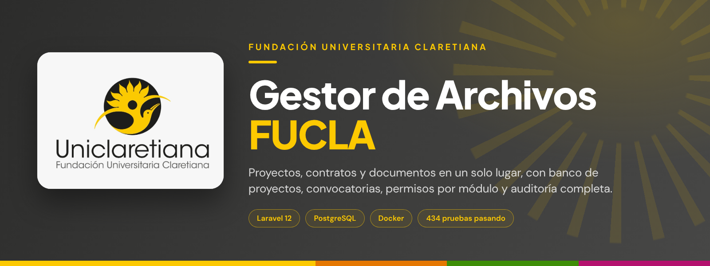

<br>


**[Funcionalidades](#-funcionalidades) · [Capturas](#-un-vistazo) · [Instalación](#-instalación-local) · [Docker](#-despliegue-con-docker) · [Identidad visual](#-identidad-visual)**

</div>

---

## 💛 ¿Qué es el Gestor de Archivos FUCLA?

Es el lugar único donde la **Fundación Universitaria Claretiana** guarda y consulta **todo lo relacionado con sus proyectos**: quién los ejecuta, con qué entidad, por cuánto valor, en qué plazo y con qué documentos de respaldo (proyecto, contrato, presupuesto, cronograma, evidencias y certificado de cumplimiento).

Se organiza en tres frentes:

| Frente | Para qué sirve |
|--------|----------------|
| 📁 **Proyectos activos** | Registro y seguimiento de proyectos y contratos en ejecución, con sus archivos y reportes exportables. |
| 🏦 **Banco de proyectos** | Propuestas que pasan por un flujo de evaluación, con anexos versionados e historial de cambios. |
| 🛡️ **Administración** | Usuarios, permisos por módulo, solicitudes de acceso, catálogos y auditoría de todo lo que ocurre. |

---

## 📸 Un vistazo

> Capturas tomadas del sistema real con datos de demostración.

<table>
  <tr>
    <td width="50%">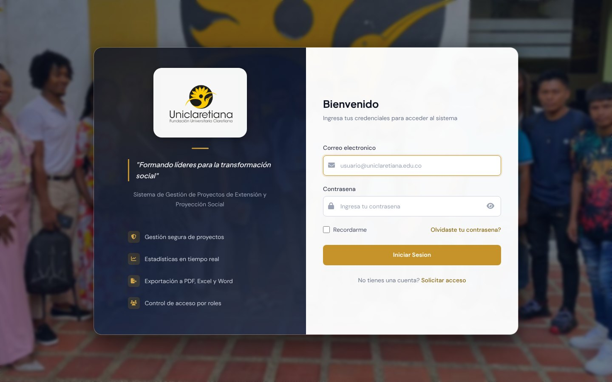<br><sub><b>Inicio de sesión</b> · con el logotipo y la imagen institucional</sub></td>
    <td width="50%">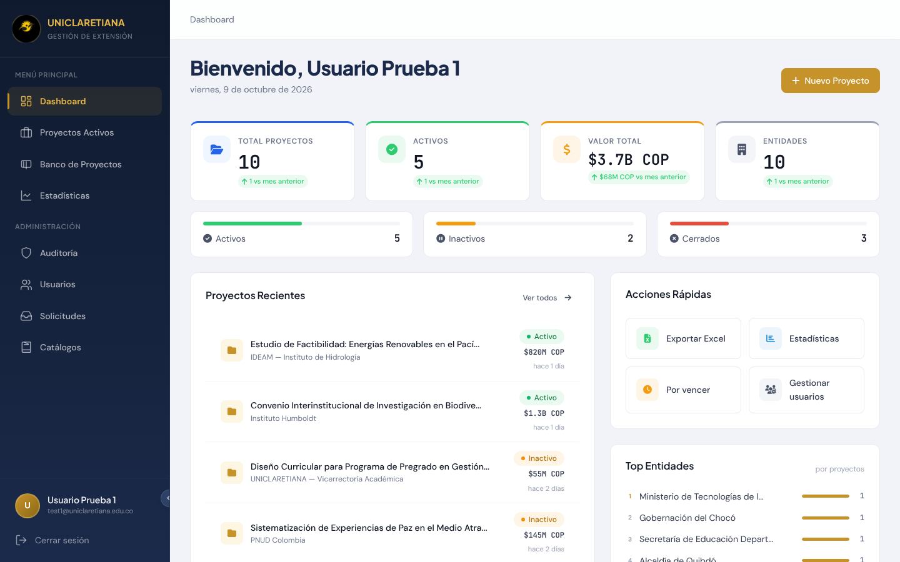<br><sub><b>Dashboard</b> · indicadores, proyectos recientes y accesos rápidos</sub></td>
  </tr>
  <tr>
    <td width="50%">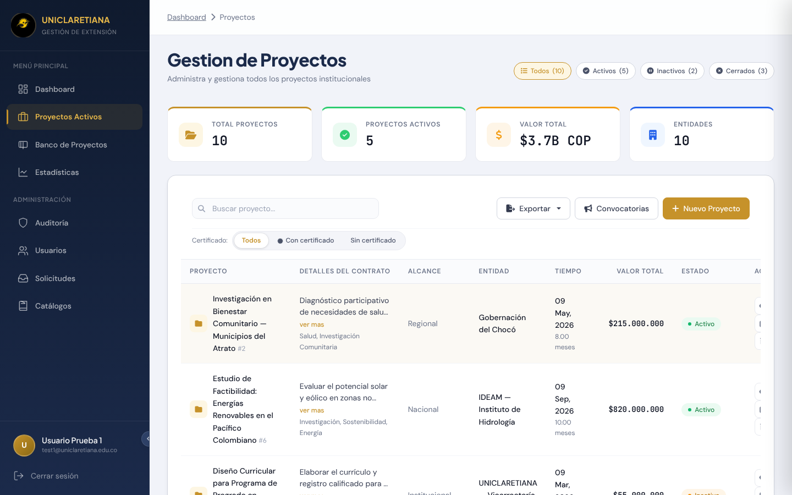<br><sub><b>Proyectos activos</b> · filtros, búsqueda, certificados y exportación</sub></td>
    <td width="50%">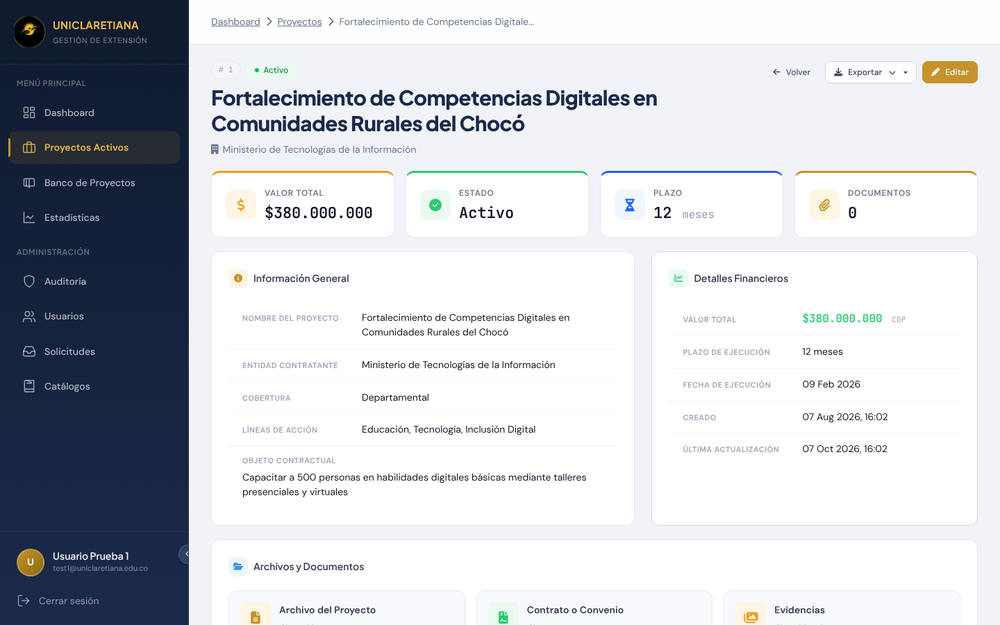<br><sub><b>Detalle del proyecto</b> · documentos, evidencias y certificado</sub></td>
  </tr>
  <tr>
    <td width="50%">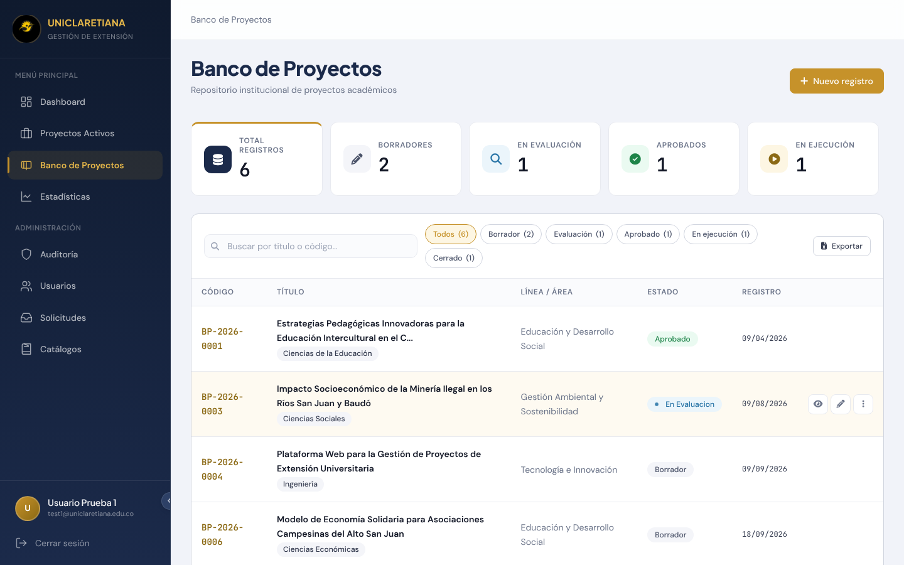<br><sub><b>Banco de proyectos</b> · propuestas por estado</sub></td>
    <td width="50%">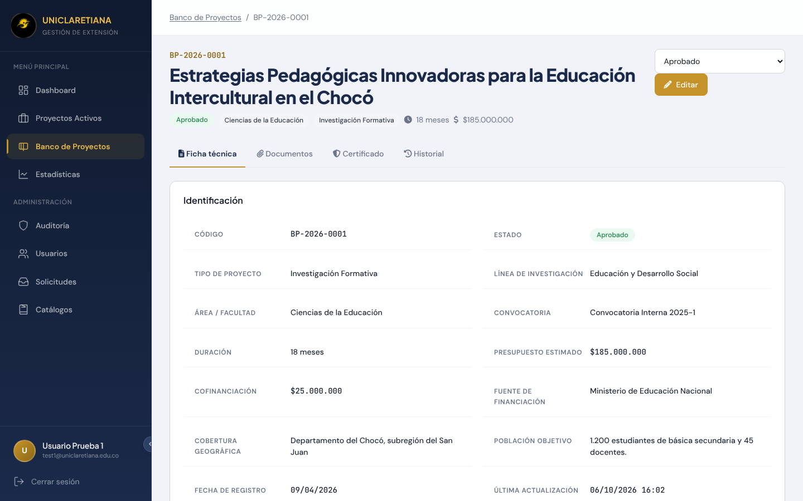<br><sub><b>Ficha técnica</b> · anexos, certificado e historial</sub></td>
  </tr>
  <tr>
    <td width="50%">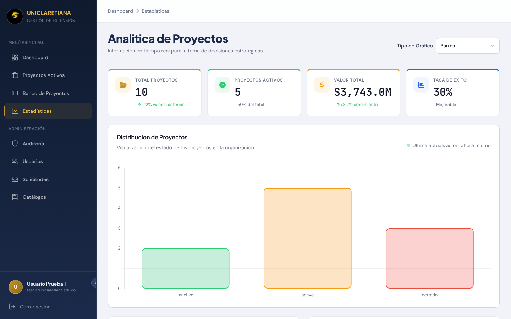<br><sub><b>Estadísticas</b> · gráficos en tiempo real</sub></td>
    <td width="50%">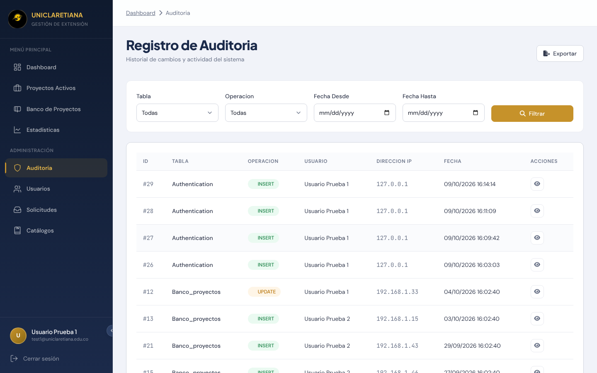<br><sub><b>Auditoría</b> · quién hizo qué, desde dónde y cuándo</sub></td>
  </tr>
  <tr>
    <td width="50%">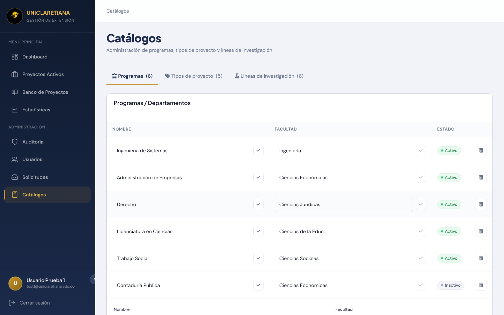<br><sub><b>Catálogos</b> · programas, tipos de proyecto y líneas</sub></td>
    <td width="50%" align="center">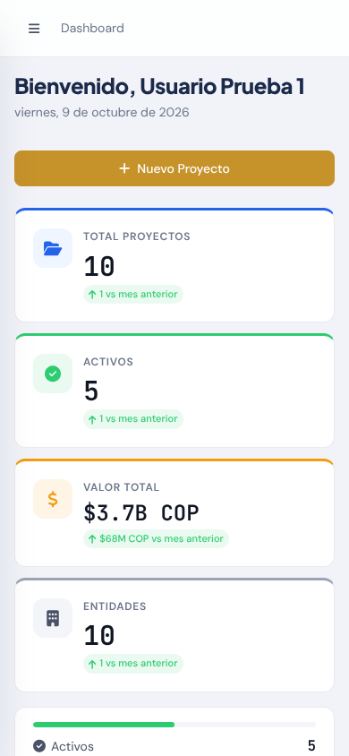<br><sub><b>Versión móvil</b> · se adapta a cualquier pantalla</sub></td>
  </tr>
</table>

---

## ✨ Funcionalidades

### 📁 Proyectos activos
- Registro de proyecto con: nombre, objeto contractual, líneas de acción, cobertura, entidad contratante, fecha de ejecución, plazo (con unidad) y valor total.
- Estado del proyecto: **activo**, **inactivo** o **cerrado**.
- Documentos asociados: **archivo del proyecto** y **contrato o convenio** (obligatorios), **presupuesto**, **cronograma** y **múltiples evidencias** (opcionales).
- **Certificado de cumplimiento** en PDF, con fecha y observaciones.
- Filtros por estado y por proyectos con o sin certificado.
- **Exportación** a **Excel**, **PDF** y **Word**, además de una ficha PDF individual por proyecto.
- Las actualizaciones solo se aceptan desde el formulario de edición, lo que evita cambios por peticiones directas.

### 🏦 Banco de proyectos
- Ficha completa de cada propuesta: código, título, línea de investigación, área o facultad, tipo de proyecto, convocatoria, resumen ejecutivo, problema o necesidad, objetivo general, justificación, alcance, población objetivo, cobertura geográfica, presupuesto estimado, fuente de financiación, cofinanciación, duración, autores (con su rol), tutor o director, programa o departamento, entidad aliada y evaluador asignado.
- **Flujo de estados**: `borrador` → `en evaluación` → `aprobado` / `rechazado` → `en ejecución` → `cerrado` (o `suspendido`).
- **Anexos versionados** de siete tipos: documento del proyecto, presupuesto, carta de aval, cronograma, imagen o plano, soporte adicional y certificado de cumplimiento. Acepta PDF, Word, Excel, JPG y PNG (hasta 10 MB), con descarga y **restauración de versiones anteriores**.
- **Historial de cambios** de cada propuesta: qué campo cambió, valor anterior y nuevo, quién y cuándo.
- Un proyecto en borrador o rechazado puede eliminarse; en otros estados, solo un administrador.
- Exportación a Excel y PDF.

### 📣 Convocatorias
- Registro de convocatorias con entidad, descripción, fechas de **inicio, cierre y resultados**, responsable, enlace y correo de contacto.

### 📊 Dashboard y estadísticas
- **Dashboard** con total de proyectos, activos, inactivos y cerrados, valor total, número de entidades, comparación con el periodo anterior y entidades con más proyectos.
- **Estadísticas** con distribución de proyectos por estado y crecimiento, en gráficos de barras u otros tipos.

### 👥 Usuarios y acceso
- Gestión de usuarios (crear, editar, eliminar, restablecer contraseña) y **matriz de permisos por módulo** para cada persona.
- **Solicitud de acceso pública**: cualquier persona puede pedir una cuenta; un administrador la aprueba o rechaza. Al aprobar, se crea el usuario con una **contraseña temporal** que se envía por correo.
- Cambio obligatorio de la contraseña temporal, **recuperación de contraseña por correo** y **verificación de cambio de correo** mediante enlace.
- Perfil personal.
- Protección del **último administrador** y contra la auto-promoción de roles.

### 🧾 Auditoría
- Registro automático de creación, actualización y eliminación de registros, y de eventos de autenticación.
- Consulta con filtros por tabla, operación y fechas, vista de detalle y **exportación**.

### 🗂️ Catálogos
- Administración de **programas** (con su facultad), **tipos de proyecto** y **líneas de investigación**, que alimentan los formularios.

---

## 🔑 Roles y permisos por módulo

Hay **dos roles** y los permisos finos se asignan por **módulo**, con dos niveles: *ver* y *editar*.

| Rol | Alcance |
|-----|---------|
| **Administrador** (`admin`) | Acceso total a todo el sistema. |
| **Usuario** (`user`) | Acceso según la matriz de permisos que le asigne un administrador. |

| Módulo | Qué controla | Nivel |
|--------|--------------|-------|
| `proyectos` | Proyectos activos y convocatorias | Ver / Editar |
| `banco` | Banco de proyectos | Ver / Editar |
| `estadistica` | Estadísticas | Solo ver |
| `auditoria` | Registro de auditoría | Solo ver |
| `usuarios` | Listado de usuarios | Solo ver |
| `solicitudes` | Solicitudes de acceso | Solo ver |
| `catalogos` | Catálogos | Solo ver |

> Las acciones de gestión sobre usuarios, permisos, solicitudes y catálogos son exclusivas del administrador.

---

## 🎨 Identidad visual

La aplicación y esta documentación siguen la imagen de la **Uniclaretiana**: el **amarillo claretiano** y el **carbón** del logotipo, con los colores de apoyo que usa su sitio web.

<div align="center">
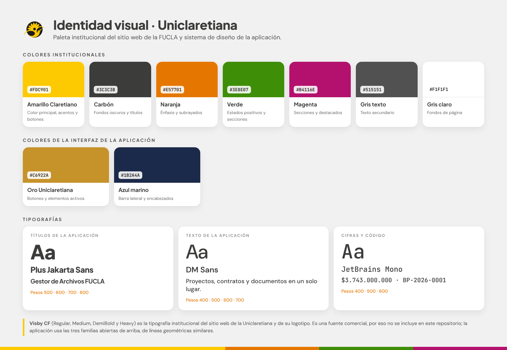
</div>

### Colores institucionales

| | Color | Hex | Uso |
|:-:|-------|-----|-----|
|  | **Amarillo Claretiano** | `#FDC901` | Color principal, acentos y botones |
|  | **Carbón** | `#3C3C3B` | Fondos oscuros y títulos |
|  | **Naranja** | `#E57701` | Énfasis y subrayados |
|  | **Verde** | `#3E8E07` | Estados positivos y secciones |
|  | **Magenta** | `#B4116E` | Secciones y destacados |
|  | **Gris texto** | `#515151` | Texto secundario |
|  | **Gris claro** | `#F1F1F1` | Fondos de página |

La interfaz de la aplicación usa además el **oro Uniclaretiana** `#C6922A` para botones y elementos activos, y el **azul marino** `#1B2A4A` para la barra lateral y los encabezados. Todos los colores viven como variables en `resources/css/design-tokens.css`.

### Tipografías

| Familia | Uso |
|---------|-----|
| **Plus Jakarta Sans** | Títulos y encabezados de la aplicación |
| **DM Sans** | Texto general de la aplicación |
| **JetBrains Mono** | Cifras, códigos y valores |
| **Visby CF** | Tipografía institucional del sitio web y del logotipo de la Uniclaretiana |

> **Visby CF** es una fuente comercial, por eso no se incluye en este repositorio. La aplicación usa las tres familias abiertas de la tabla (se cargan desde Google Fonts), de líneas geométricas similares.

---

## 🏗️ Arquitectura y stack

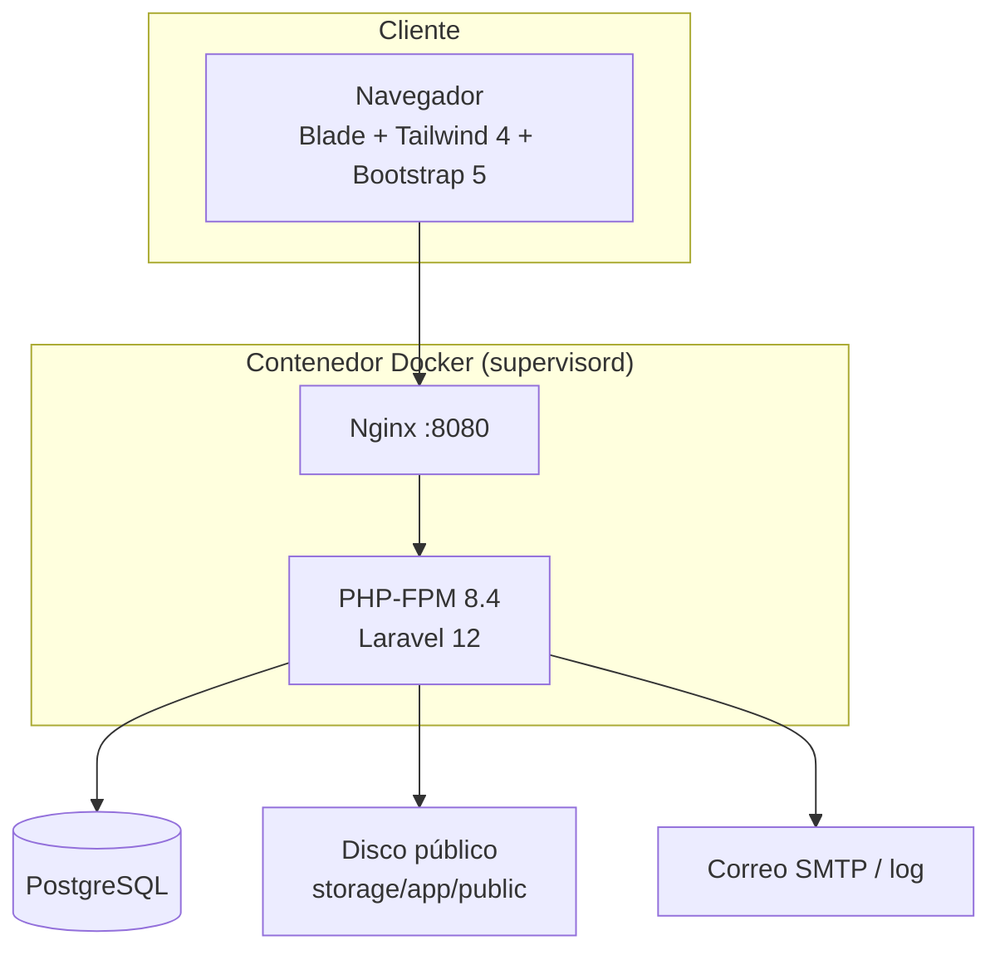

| Capa | Tecnología |
|------|-----------|
| Backend | **Laravel 12** (PHP ≥ 8.2; probado en 8.3 y con imagen Docker en 8.4) |
| Base de datos | **PostgreSQL** (`pdo_pgsql`) |
| Frontend | Blade, **Tailwind CSS 4**, Bootstrap 5, Lucide, Axios |
| Build | **Vite 7** + `laravel-vite-plugin` |
| Reportes | `barryvdh/laravel-dompdf` (PDF), `phpoffice/phpspreadsheet` (Excel), `phpoffice/phpword` (Word) |
| Imágenes | `intervention/image` |
| Infraestructura | Docker (Node 22 + PHP 8.4-FPM Alpine), Nginx, Supervisor |
| Calidad | PHPUnit 11, Laravel Pint |

---

## 🚀 Instalación local

### Requisitos
- PHP **≥ 8.2** con las extensiones `pdo_pgsql`, `pgsql`, `gd`, `zip`, `bcmath`, `mbstring`, `xml`, `intl` y `exif`
- Composer 2
- Node.js **20+** y npm
- PostgreSQL 14+ (probado con 16)

### Paso a paso

```bash
# 1. Clonar
git clone https://github.com/Bello2005/gestorFucla.git
cd gestorFucla

# 2. Dependencias
composer install
npm install

# 3. Entorno
cp .env.example .env
php artisan key:generate
```

4. **Crea una base de datos vacía en PostgreSQL** y completa en `.env` los datos de conexión (`DB_HOST`, `DB_PORT`, `DB_DATABASE`, `DB_USERNAME`, `DB_PASSWORD`). Para una base local sin SSL, usa `DB_SSLMODE=disable`.

```bash
# 5. Estructura de la base de datos y datos iniciales
php artisan migrate
php artisan db:seed

# 6. Enlace para los archivos subidos y estilos
php artisan storage:link
npm run build          # o: npm run dev  (modo desarrollo)

# 7. Levantar el servidor
php artisan serve
```

Abre `http://localhost:8000`.

> 🗄️ **Sobre la base de datos:** el repositorio **no incluye datos reales**. La estructura completa (25 tablas) se crea con `php artisan migrate`, y `php artisan db:seed` carga roles, módulos, catálogos y datos de demostración.

### Primer administrador

`php artisan db:seed` carga roles, módulos, catálogos y **datos de demostración**, incluidos **3 usuarios de ejemplo** (`test1`, `test2` y `test3` en `@uniclaretiana.edu.co`). Sirven para probar en desarrollo.

Para un entorno **real**, no ejecutes `db:seed` completo. Carga solo la base y crea tu propio administrador:

```bash
# 1. Datos base (roles, módulos y catálogos)
php artisan db:seed --class=RolesSeeder
php artisan db:seed --class=ModulesSeeder
php artisan db:seed --class=CatalogoSeeder

# 2. Crear el primer usuario (cambia nombre, correo y contraseña)
php artisan tinker --execute="App\\Models\\User::create(['name' => 'Administrador', 'email' => 'correo@ejemplo.com', 'password' => 'UnaClaveSegura-123']);"

# 3. Darle el rol de administrador
php artisan users:assign-admin correo@ejemplo.com
```

Con ese usuario ya puedes iniciar sesión, aprobar solicitudes de acceso y asignar permisos al resto del equipo.

---

## ⚙️ Variables de entorno

Las principales, definidas en `.env.example`:

| Variable | Descripción |
|----------|-------------|
| `APP_NAME`, `APP_ENV`, `APP_DEBUG`, `APP_URL` | Identidad y modo de la aplicación. En producción: `APP_DEBUG=false`. |
| `APP_KEY` | Se genera con `php artisan key:generate`. |
| `DB_HOST`, `DB_PORT`, `DB_DATABASE`, `DB_USERNAME`, `DB_PASSWORD` | Conexión a PostgreSQL. |
| `DB_SSLMODE` | `require` en la nube; `disable` para PostgreSQL local sin SSL. |
| `SESSION_DRIVER`, `SESSION_LIFETIME`, `SESSION_DOMAIN` | Configuración de sesión. |
| `CACHE_DRIVER`, `QUEUE_CONNECTION` | Caché (`file`) y cola (`sync` ejecuta los trabajos en la misma petición). |
| `FILESYSTEM_DISK` | Disco de archivos (`public` por defecto). |
| `MAIL_MAILER`, `MAIL_HOST`, `MAIL_PORT`, `MAIL_USERNAME`, `MAIL_PASSWORD`, `MAIL_FROM_ADDRESS` | Envío de correo. Por defecto es `log` (los correos se escriben en el log y **no se envían**). Configura SMTP para producción. |

> ⚠️ **Nunca** subas valores reales de claves o contraseñas al repositorio. Define las variables en el panel de tu proveedor de despliegue.

---

## 🐳 Despliegue con Docker

La imagen (`Dockerfile`) compila los estilos con Node 22 y construye el contenedor final con **PHP 8.4-FPM, Nginx y Supervisor**. El servicio escucha en el puerto **8080**.

```bash
docker build -t gestor-fucla .
docker run -p 8080:8080 \
  -e APP_KEY="base64:..." \
  -e APP_URL="https://tu-dominio.com" \
  -e DB_HOST="..." -e DB_PORT=5432 -e DB_DATABASE="..." \
  -e DB_USERNAME="..." -e DB_PASSWORD="..." -e DB_SSLMODE=require \
  gestor-fucla
```

Al iniciar, `docker/start.sh` hace esto automáticamente:
1. Genera el `.env` a partir de las variables de entorno del contenedor.
2. Si no hay `APP_KEY`, crea una.
3. Cachea configuración, rutas y vistas.
4. Ejecuta **`php artisan migrate --force`** (crea o actualiza la base de datos).
5. Crea el enlace `storage:link`.

> 💾 **Archivos subidos:** se guardan en `storage/app/public`. En plataformas con disco efímero, **monta un volumen persistente** en esa carpeta; si no, los archivos se pierden en cada despliegue.
>
> 👤 **Primer administrador:** tras el primer arranque, sigue los tres pasos de [Primer administrador](#primer-administrador) dentro del contenedor.

---

## 🗂️ Estructura del proyecto

```
.
├── app/
│   ├── Console/Commands/      # users:assign-admin, app:test-email
│   ├── Http/
│   │   ├── Controllers/       # Proyecto, BancoProyecto, Convocatoria, Catalogo, Audit, User, Permission…
│   │   ├── Middleware/        # Admin, RequireModulePermission, auditoría, límites de carga
│   │   └── Requests/          # Validación de proyectos
│   ├── Models/                # Proyecto, BancoProyecto (+Anexo, +Historial), Convocatoria, Module…
│   ├── Services/              # ProyectoFileService, ProyectoExportService, PasswordService
│   ├── Traits/ · Observers/   # Auditable, AuditObserver
│   └── Mail/ · Notifications/ # Correos transaccionales
├── database/
│   ├── migrations/            # 32 migraciones
│   └── seeders/               # Roles, módulos, catálogos y datos de demostración
├── resources/
│   ├── css/                   # Sistema de diseño (design-tokens.css, componentes, páginas)
│   └── views/                 # Blade: dashboard, proyectos, banco, catálogos, auditoría, usuarios…
├── routes/web.php             # Rutas públicas, autenticadas y de administrador
├── docker/                    # Nginx, Supervisor y script de arranque
├── docs/                      # Banner, identidad visual y capturas de este README
├── tests/                     # 42 archivos de pruebas (Unit y Feature)
└── Dockerfile
```

---

## 🧪 Pruebas automáticas

El proyecto incluye **42 archivos de pruebas con 434 pruebas y 791 verificaciones, todas pasando**. Cubren autenticación, proyectos, banco de proyectos, convocatorias, catálogos, permisos, auditoría, exportaciones y manejo de errores.

```bash
php artisan test
# o
./vendor/bin/phpunit
```

---

## 🧰 Comandos útiles

```bash
php artisan users:assign-admin correo@ejemplo.com   # Asigna el rol de administrador
php artisan app:test-email correo@ejemplo.com       # Prueba el envío de correo
php artisan migrate                                 # Crea o actualiza la base de datos
php artisan storage:link                            # Enlaza los archivos subidos
php artisan test                                    # Ejecuta las pruebas
./vendor/bin/pint                                   # Formatea el código (Laravel Pint)
```

---

## 🔒 Seguridad antes de producción

- [ ] `APP_DEBUG=false` y `APP_ENV=production`.
- [ ] Todas las claves y contraseñas definidas **solo** como variables de entorno del proveedor.
- [ ] No ejecutar `db:seed` completo en producción, o cambiar/eliminar los usuarios de ejemplo (`test1`, `test2`, `test3`).
- [ ] Configurar un servidor SMTP real (`MAIL_MAILER`), porque por defecto los correos no se envían.
- [ ] Volumen persistente para `storage/app/public`.
- [ ] HTTPS activo y `APP_URL` con `https://`.

Si encuentras una vulnerabilidad, repórtala de forma privada al autor en lugar de abrir un *issue* público.

---

## 👤 Autoría

Desarrollado por **Luis Delascar Valencia**.

Proyecto desarrollado para la **Fundación Universitaria Claretiana (FUCLA)**.

---

<div align="center">

💛 **Gestor de Archivos FUCLA** · Proyectos, documentos y trazabilidad en un solo lugar.

</div>
